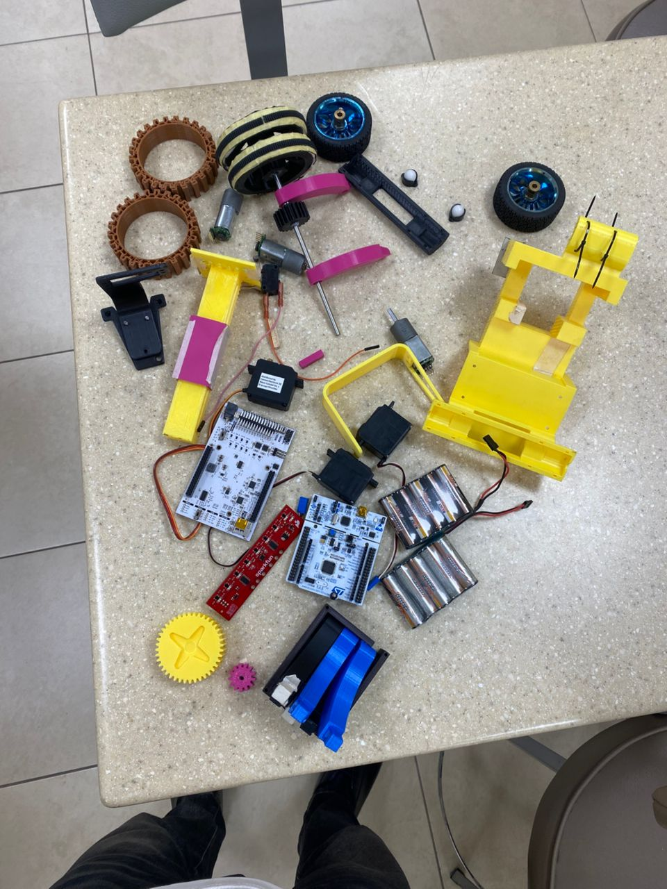
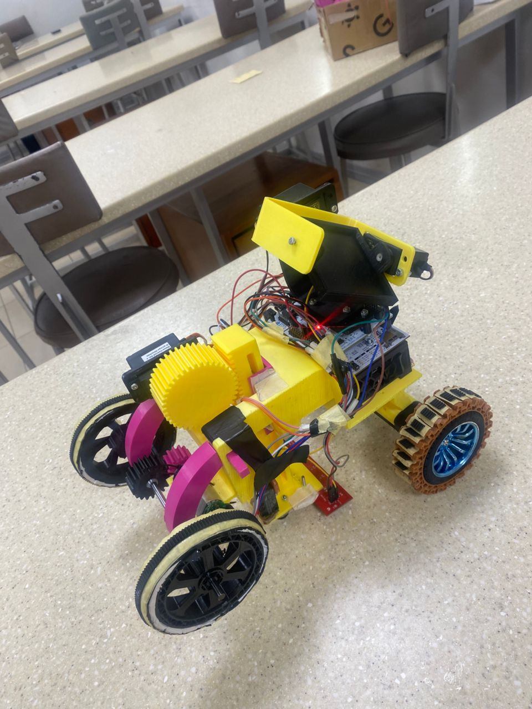

# This is a brief overview of what the team acheived

## The components are as seen below

      
    <i>Components for Assembly</i>

 

## Assembled gyronaut drive

      
    <i>Components for Assembly</i>

 

# Videos of working solution can be found at ;\PES_Board-1\docs\videos.

# Thanks to Wuthrich Michael and Peter Michael.