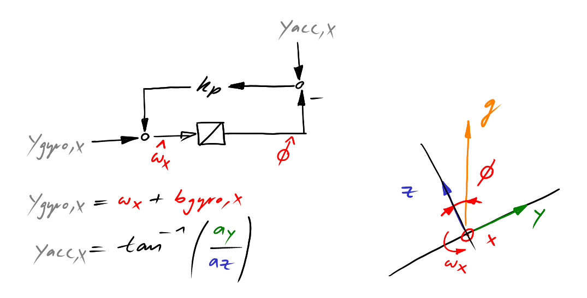
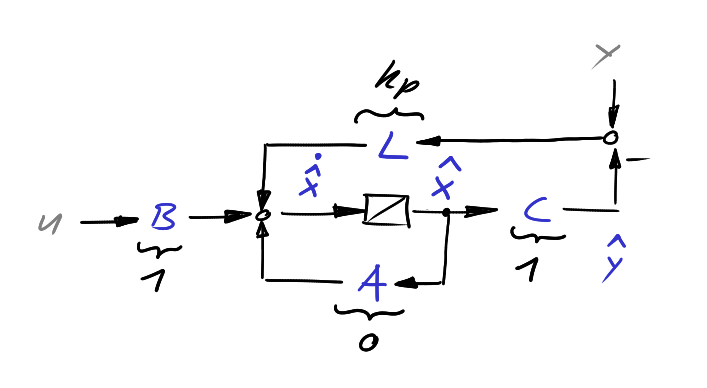
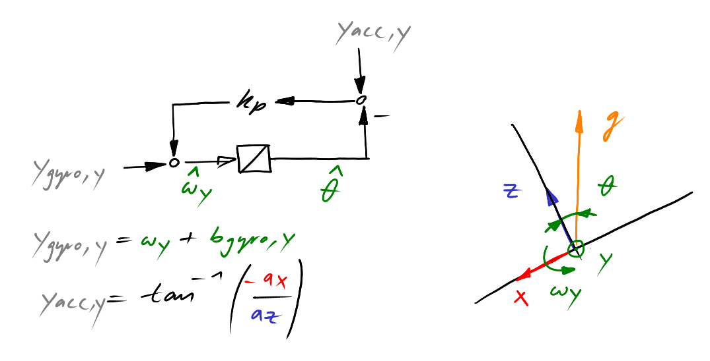

<!-- link list, last updated 15.01.2023 -->
[0]: https://www.sparkfun.com/products/retired/13284
[1]: https://compsci290-s2016.github.io/CoursePage/Materials/EulerAnglesViz/
[2]: https://www.youtube.com/watch?v=whSw42XddsU

# 1-D Mahony Filter

We look at the theoretical background of the 1-D Mahony filter, which is a sensor fusion algorithm used to estimate the orientation of an IMU (Inertial Measurement Unit) in space. The 1-D Mahony filter is a simplified version of the 3-D Mahony filter, focusing on estimating orientation around a single axis.

## Roll Angle - Rotation around the X-axis

      
    <i>Sketch Mahony Roll</i>

We start by using at the block diagram of the 1-D Mahony filter for the roll angle.

      
    <i>Sketch Filter Structure</i>

Clearly this can be intepreted as a linear estimator in state space form. By comparing the structure of the 1-D Mahony filter with the structure of a linear estimator we get $\mathbf{A} = 0$, $\mathbf{B} = 1$, $\mathbf{C} = 1$ and $\mathbf{L} = k_p$.

$\mathbf{L} = k_p$ can be tuned as a Luenberger observer (pole-placement) or as a Kalman filter (steady-state Kalman gain). An alternative approach is to relate the 1D-Mahony filter to the Complementary filter.

We calculate the input-output relationship of the 1-D Mahony filter by decriping the dynamics as transfer functions. The input-output relationships are given by

$$
y_{acc,x} \rightarrow \hat{\phi}: G_{\hat{\phi}, y_{acc,x}}(s) = \frac{k_p}{s + k_p}
$$

and

$$
y_{gyro,x} \rightarrow \hat{\phi}: G_{\hat{\phi}, y_{gyro,x}}(s) = \frac{1}{s + k_p}
$$

Combining these two transfer functions we get the dynamics of the 1-D Mahony filter in the form

$$
\hat{\phi} = \frac{1}{1/k_p s + 1} \ y_{acc,x} + \frac{1/k_p}{1/k_p s + 1} \ y_{gyro,x}
$$

Whit the substitution $T = 1/k_p$ we see that the 1-D Mahony filter is in fact identical to the Complementary filter. The gain $k_p$ can be used to tune the dynamics of the filter.

## Discretization of the 1-D Mahony filter

Given the differential equations of the 1-D Mahony filter as

$$
\dot{\hat{\phi}}(t) = y_{gyro,x}(t) + k_p\ (y_{acc,x}(t) - \hat{\phi}(t))
$$

we can use the Euler method to discretize the filter. The Euler method is given by

$$
\hat{\phi}[k] = \hat{\phi}[k-1] + T_s\ \dot{\hat{\phi}}[k]
$$

Substituting the differential equation into the Euler method we get

$$
\hat{\phi}[k] = \hat{\phi}[k-1] + T_s\ (y_{gyro,x}[k] + k_p\ (y_{acc,x}[k] - \hat{\phi}[k-1]))
$$

This form is suitable for implementation.

## Pitch Angle - Rotation around the Y-axis

      
    <i>Sketch Mahony Pitch</i>

