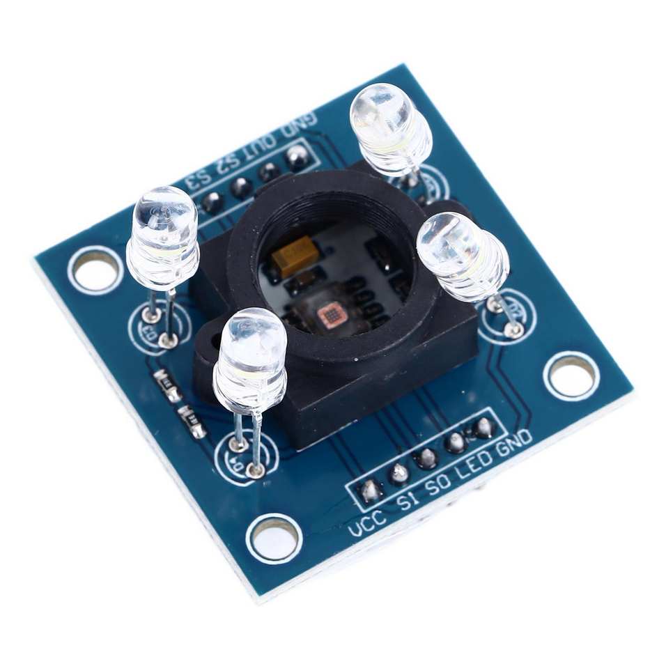

<!-- link list, last updated 10.02.2026 -->
[0]: https://www.mouser.com/datasheet/2/588/TCS3200-E11-1120711.pdf
[1]: https://www.sparkfun.com/products/retired/9426
[2]: https://www.taos.com/
[3]: https://lastminuteengineers.com/tcs3200-color-sensor-arduino-tutorial/
[4]: https://os.mbed.com/platforms/ST-Nucleo-F446RE/

# Color Sensor


The TCS3200 color sensor is a programmable color light-to-frequency converter that combines configurable silicon photodiodes and a current-to-frequency converter on a single monolithic CMOS integrated circuit. The sensor outputs a square wave frequency directly proportional to the light intensity of the detected color (Red, Green, Blue, or Clear). This device is valuable for color detection, color sorting, ambient light sensing, and RGB LED color matching applications. It provides a cost-effective and straightforward solution for projects requiring accurate color measurement.


><b>How does it work?</b><br>
>The TCS3200 contains an array of photodiodes with red, green, blue, and clear filters. By controlling two input pins (S2 and S3), you can select which color filter to read. The sensor converts the light intensity into a frequency signal that can be measured using a microcontroller. The output frequency ranges from 2 Hz to 500 kHz, with higher frequencies indicating higher light intensity. Two additional pins (S0 and S1) control the output frequency scaling to 2%, 20%, or 100%.
>
><p align="center">
>     </br>
>    <i> TCS3200 Color Sensor Working Principle </i>
></p>
>
> More detailed explanation can be found [here][3].

<p align="center">
     </br>
    <i> Example of TCS3200 Color Sensor Module </i>
</p>

## Technical Specifications

|                                     |        |                       | TCS3200                            |
| ----------------------------------- | ------ | --------------------- | ---------------------------------- |
|                                     | Symbol | Conditions            |                                    |
| **Absolute Maximum Ratings**        |        | Ta=25 °C              |                                    |
| Supply Voltage                      | VDD    |                       | -0.5 to +7.0 V                     |
| Input/Output Voltage                | VI/O   |                       | -0.5 to VDD + 0.5 V                |
| Operating Temperature               | Topr   |                       | -40 to +85 °C                      |
| Storage Temperature                 | Tstg   |                       | -40 to +85 °C                      |
| **Operating Supply Voltage**        |
| Supply Voltage                      | VDD    |                       | 2.7 to 5.5 V                       |
| **Electro-optical Characteristics** |        | Ta=25 °C, VDD = 5 VDC |                                    |
| Output Frequency Range              | fO     | 100% scaling          | 2 Hz to 500 kHz                    |
| Output Duty Cycle                   |        |                       | 50% ± 10%                          |
| Resolution                          |        |                       | 16-bit (typical)                   |
| PTCS3200 Datasheet][0] <br>
- [SparkFun TCS3200 Module][1] <br>
- [TAOS (ams) Website][2] <br>

## Datasheets

- [TCS3200 Programmable Color Light-to-Frequency Converter](../datasheets/TCS3200-datasheet

- [Sharp GP2D120](../datasheets/GP2D120-DATA-SHEET.pdf) <br>
- [Sharp GP2Y0A21YK0F](../datasheets/gp2y0a21yk0f.pdf) <br>
- [Sharp GP2Y0A41SK0F](../datasheets/GP2Y0A41SK0F.pdf)

##Ambient lighting can significantly affect color readings. For best results, use the sensor in consistent lighting conditions or shield it from external light sources.
* The sensor works best when positioned 5-10 mm away from the surface being measured. Too close or too far can affect accuracy.
* White balance calibration is essential for accurate color detection. Always calibrate against a known white surface before taking measurements.
* The surface texture and glossiness can affect readings. Matte surfaces typically provide more consistent results than glossy ones.
* Use frequency scaling (S0/S1 pins) appropriately - higher scaling gives faster readings but may reduce accuracy in low-light conditions.

## TCS3200 Color Sensor Module

The TCS3200 outputs a square wave frequency that must be measured using a digital input pin and timing functions. The ``PwmIn`` class or interrupt-based frequency measurement can be used to read the output signal.

### Connection to the Nucleo-Board

The TCS3200 sensor module typically has 8 pins:
- **VCC**: Connect to 5.0V
- **GND**: Connect to ground
- **S0, S1**: Frequency scaling selection pins (connect to digital output pins)
- **S2, S3**: Color filter selection pins (connect to digital output pins)
### Color Filter and Frequency Scaling Selection

The TCS3200 uses two sets of control pins:

**S2/S3 pins (Color Filter Selection):**
- S2=LOW, S3=LOW: Red filter
- S2=LOW, S3=HIGH: Blue filter
- S2=HIGH, S3=LOW: Clear (no filter)
- S2=HIGH, S3=HIGH: Green filter

**S0/S1 pins (Output Frequency Scaling):**
- S0=LOW, S1=LOW: Power down
- S0=LOW, S1=HIGH: 2% scaling
- S0=HIGH, S1=LOW: 20% scaling
- S0=HIGH, S1=HIGH: 100% scaling

### Create Color Sensor Objects

To start working with the sensor, it is necessary to connect it correctly and create the appropriate objects
If you are not sure how to connect the sensor, click the following hint.

<detaildigital output objects for the control pins and a frequency input for the output signal:

```cpp
// TCS3200 color sensor
DigitalOut s0(PB_3);   // frequency scaling
DigitalOut s1(PB_5);   // frequency scaling
DigitalOut s2(PB_4);   // color filter selection
DigitalOut s3(PB_10);  // color filter selection
PwmIn color_out(PC_6); // frequency output from sensor

// variables to store color frequency readings
float red_foutputs frequency values that vary based on ambient lighting, sensor variations, and the surface being measured. To achieve accurate color detection, calibration is necessary to normalize the sensor readings. This typically involves measuring white and black reference surfaces to establish minimum and maximum values for each color channel.

><b>Why do we need calibration?</b><br>
>Calibrating the TCS3200 color sensor is essential to:
>1. **Compensate for ambient lighting variations** - Different lighting conditions affect the absolute frequency readings
>2. **Normalize sensor variations** - Each sensor may have slightly different photodiode sensitivities
>3. **Establish a baseline** - White balance calibration allows you to measure colors relative to a known reference
>4. **Improve color discrimination** - Normalized values make it easier to distinguish between different colors
>
>The calibration process typically involves:
>- Measuring a white surface to get maximum values for R, G, B channels
>- Measuring a black surface to get minimum values for R, G, B channels
>- Calculating normalized values using: `normalized = (measured - black) / (white - black)`

<br>

The TCS3200 color sensor module
> - Mini USB cable
> - Additional wires to connect the sensor to the NUCLEO board
> - White paper/card (for white balance calibration)
> - Black paper/card (for black reference)
> - Colored paper samples (red, green, blue, yellow, etc.) for testing
>
> Software:
> - Serial terminal program (e.g., PuTTY, Tera Term, or VS Code Serial Monitor)
> - Optional: MATLAB or Python for advanced color analysis
```

First, set up the frequency scaling to 20% for more manageable frequency readings:

```cpp
// set frequency scaling to 20%
s0 = 1;
s1 = 0;
```

Create a function to read each color channel by selecting the appropriate filter:

```cpp
float read_color_frequency(int color) {
    // color: 0=Red, 1=Blue, 2=Clear, 3=Green
    switch(color) {
        case 0: // Red
            s2 = 0; s3 = 0;
            break;
        case 1: // Blue
            s2 = 0; s3 = 1;
            break;
        case 2: // Clear
            s2 = 1; s3 = 0;
            break;
        case 3: // Green
            s2 = 1; s3 = 1;
            break;
    }
    
    // wait for sensor to stabilize
    ThisThread::sleep_for(100ms);
    
    // read frequency
    float frequency = color_out.frequency();
    
    return frequency;
}
```

**Calibration Steps:**

1. **White Balance Calibration** - Place a white paper under the sensor (5-10 mm distance) and record the frequency values for each color channel:

```cpp
// read white reference values
float white_red = read_color_frequency(0);
float white_green = read_color_frequency(3);
float white_blue = read_color_frequency(1);

printf("White: R=%f G=%f B=%f\n", white_red, white_green, white_blue);
```

2. **Black Reference Calibration** - Place a black paper under the sensor and record the frequency values:

```cpp
// read black reference values
float black_red = read_color_frequency(0);
float black_green = read_color_frequency(3);
float black_blue = read_color_frequency(1);

printf("Black: R=%f G=%f B=%f\n", black_red, black_green, black_blue);
```

3. **Create Normalization Function** - Use the calibration values to normalize future readings:

```cpp
void normalize_color(float red, float green, float blue, 
                     float &norm_red, float &norm_green, float &norm_blue) {
    // calibration values (insert your measured values here)
    static const float white_r = 50.0f, white_g = 55.0f, white_b = 45.0f;
    static const float black_r = 10.0f, black_g = 12.0f, black_b = 9.0f;
    
    // normalize to 0.0 - 1.0 range
    norm_red = (red - black_r) / (white_r - black_r);
    norm_green = (green - black_g) / (white_g - black_g);
    norm_blue = (blue - black_b) / (white_b - black_b);
    
    // clamp values to 0.0 - 1.0
    norm_red = (norm_red < 0.0f) ? 0.0f : ((norm_red > 1.0f) ? 1.0f : norm_red);
    norm_green = (norm_green < 0.0f) ? 0.0f : ((norm_green > 1.0f) ? 1.0f : norm_green);
    norm_blue = (norm_blue < 0.0f) ? 0.0f : ((norm_blue > 1.0f) ? 1.0f : norm_blue);
}
```

4. **Test with Known Colors** - After calibration, test the sensor with colored papers (red, green, blue, yellow) and verify that the normalized values make sense.

```cpp
// read current color
float red = read_color_frequency(0);
float green = read_color_frequency(3);
float blue = read_color_frequency(1);

// normalize
float norm_r, norm_g, norm_b;
normalize_color(red, green, blue, norm_r, norm_g, norm_b);

printf("Raw: R=%f G=%f B=%f\n", red, green, blue);
printf("Normalized: R=%f G=%f B=%f\n", norm_r, norm_g, norm_b);
```

**Color Detection Logic** - After calibration, you can implement simple color detection:

```cpp
const char* detect_color(float r, float g, float b) {
    // threshold for color detection
    const float threshold = 0.3f;
    
    if (r > threshold && g < threshold && b < threshold) {
        return "RED";
    } else if (r < threshold && g > threshold && b < threshold) {
        return "GREEN";
    } else if (r < threshold && g < threshold && b > threshold) {
        return "BLUE";
    } else if (r > threshold && g > threshold && b < threshold) {
        return "YELLOW";
    } else if (r > threshold && g < threshold && b > threshold) {
    frequency readings from the TCS3200 can be noisy due to ambient light variations and surface irregularities. To improve signal quality, you can implement:

1. **Multiple Readings Average** - Take several readings and average them:

```cpp
float read_color_averaged(int color, int samples = 10) {
    float sum = 0.0f;
    for(int i = 0; i < samples; i++) {
        sum += read_color_frequency(color);
        ThisThread::sleep_for(10ms);
    }
    return sum / samples;
}
```

2. **Median Filter** - Use a median filter to reject outliers:

```cpp
#include <algorithm>

float read_color_median(int color, int samples = 5) {
    float readings[samples];
    for(int i = 0; i < samples; i++) {
        readings[i] = read_color_frequency(color);
        ThisThread::sleep_for(10ms);
    }
    std::sort(readings, readings + samples);
    return readings[samples / 2];
}
```

3. **Using ColorSensor Class** - If available in the library, use the ``ColorSensor`` class that implements filtering and calibration:

```cpp
ColorSensor color_sensor(PC_6, PB_4, PB_10, PB_3, PB_5);
                        // OUT,  S2,   S3,    S0,   S1

// set calibration values
color_sensor.setWhiteBalance(50.0f, 55.0f, 45.0f);
color_sensor.setBlackReference(10.0f, 12.0f, 9.0f);

// read normalized RGB values
float r, g, b;
color_sensor.readRGB(r, g, b);
```

## Application Examples

**Line Following** - The TCS3200 can be used for line following robots by detecting the color of the line versus the background:

```cpp
// detect black line on white background
float r, g, b;
normalize_color(red_frequency, green_frequency, blue_frequency, r, g, b);

float brightness = (r + g + b) / 3.0f;
if(brightness < 0.3f) {
    printf("Black line detected!\n");
}
```

**Color Sorting** - Identify and sort objects by color:

```cpp
const char* color = detect_color(norm_r, norm_g, norm_b);
printf("Detected color: %s\n", color);

if(strcmp(color, "RED") == 0) {
    // activate sorting mechanism for red objects
}
```

## Examples

- [Example Color Sensor Basic Reading](../solutions/main_color_sensor.cpp)
- [Example Color Sensor with Calibration](../solutions/main_color_sensor_calibrated.cpp)
- [Example Color Detection and Sorting](../solutions/main_color_detection