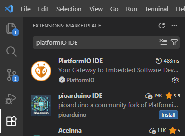
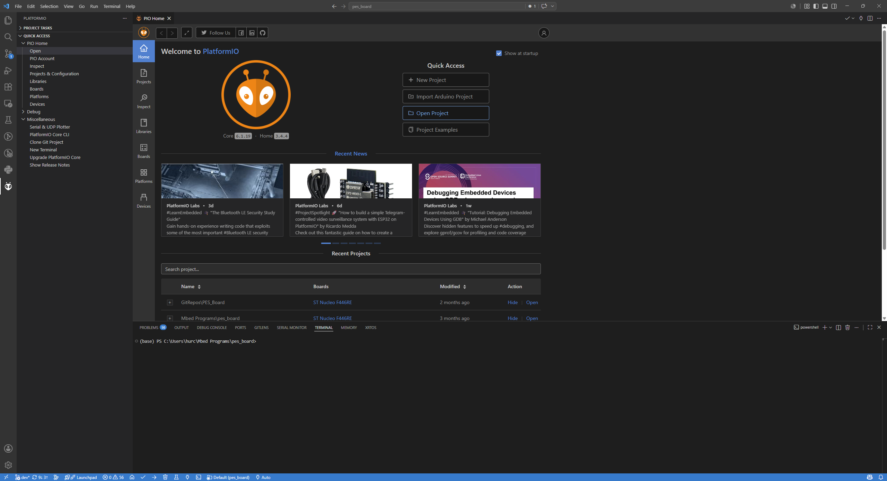
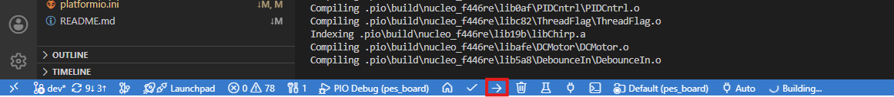

# Course Setup

This site guides you through the essential steps to begin the course, starting from creating accounts on required platforms to downloading the relevant software used during the workshops and for your project.

## Accounts

It is recommended that you use a private email address to set up accounts on Mbed and on GitHub. To be able to use MATLAB it is mandatory to use the account from your university because of the corresponding license.

- GitHub: https://github.com/ Private email
- Mbed: https://os.mbed.com/ Private email
- MATLAB: https://matlab.mathworks.com/ University account

## Software

- Mbed Studio: https://os.mbed.com/studio/ Free IDE for the Mbed OS ecosystem
- PuTTY: https://www.putty.org/ SSH and telnet client
- MATLAB: https://matlab.mathworks.com/  Programming and numerical computing platform
- Visual Studio Code: https://code.visualstudio.com/download Code editor with support for development operations
- STLink Driver: https://www.st.com/en/development-tools/stsw-link009.html Drivers, so you can flash code to the microcontroller using PlatformIO
- Git: https://git-scm.com/install/windows Version control system for tracking changes in source code during software development

## GitHub

GitHub is a web-based platform from Microsoft for version control using Git, facilitating collaborative software development by providing tools for code hosting, tracking changes, and managing project workflows. It allows developers to work on projects simultaneously, merge their changes seamlessly, and track the project's history. GitHub is widely used in the software development community for code collaboration, issue tracking, and hosting open-source projects.

* To create a fork of the PES Board repository you need to go to the repository on GitHub: https://github.com/pichim/PES_Board
* On the top right corner click **Fork**:

<p align="center">
     </br>
    <i>Forking the Repository</i>
</p>

* Click **Create fork**.

By forking the repository, you can freely experiment with changes without affecting the original project. This fork is now your own version of the repository. You can make changes to files and push commits to your fork's branch.

## Arm Mbed

Arm Mbed is a comprehensive embedded systems development platform, it offers a range of tools, libraries, and access to a real-time C++ based OS to simplify and accelerate the development process for Arm-based microcontrollers. Mbed provides a unified and scalable environment, supporting diverse applications in the field of embedded systems and IoT.

### Mbed Studio

Arm Mbed Studio is an integrated development environment (IDE) designed for embedded systems. It offers a user-friendly interface with features such as a powerful code editor, compiler, and debugger, streamlining the process of coding for Arm-based microcontrollers. Mbed Studio supports Mbed OS and enables seamless development, compilation, and debugging of embedded applications in a single environment.

<p align="center">
     </br>
    <i>Mbed Studio</i>
</p>

### Mbed OS Version

During the course we are working with Mbed OS version 6. It is important to keep this in mind when you are looking for documentation or examples on the internet. There are many examples from older versions of Mbed OS, especially Mbed OS 2 but we need Mbed OS 6.

### Importing Your First Project

Importing a program from GitHub to Mbed Studio involves linking the local repository with Mbed Studio, enabling seamless collaboration and development on the chosen project:
* Once Mbed Studio is installed, the next step involves creating the program intended for use during the class. This program should be imported from the previously forked repository. Open the **File** menu and select **Import Program**

<p align="center">
     </br>
    <i>Importing the Program</i>
</p>

* Visit the GitHub page of your repository (e.g., https://github.com/YOUR_NICK/NAME_OF_FORKED_REPOSITORY) and copy the **HTTPS** URL, located below the box on your forked repository.

<p align="center">
     </br>
    <i>HTTPS link GitHub</i>
</p>

* Paste the full **HTTPS** URL of the relevant web page and (optionally) edit the program name.
* If you are changing the **Project name**, it is good practice to name projects with capital letters, so they can be distinguished from libraries (often lowercase letters).

<p align="center">
     </br>
    <i>Importing Program 1</i>
</p>

* Then click **Add program**, by default this will be the active program in Mbed Studio.
* To complete the setup you need to choose the **Target** by typing the Nucleo Board type that will be used: In our case **NUCLEO-F446RE**.

<p align="center">
     </br>
    <i>Importing Program 2</i>
</p>

### Building a Program

Building a program in Mbed Studio involves the process of compiling and linking the source code to create an executable binary file (***.bin** file) that can run on the specific microcontroller. The build process ensures that the code is translated into machine code compatible with the target platform. Once the program is successfully built, the resulting binary file can be loaded onto the microcontroller board to execute the desired functionality.

In Mbed Studio, there are three build profiles:

1. **Debug Profile:**
   - **Purpose:** Primarily used for debugging and development.
   - **Optimizations:** Limited optimizations to aid debugging, resulting in larger binaries.
   - **Symbols:** Includes debugging symbols to facilitate source-level debugging.
   - **Compile Time:** Longer compile times due to additional information included.

2. **Develop Profile:**
   - **Purpose:** Balanced profile for development and testing.
   - **Optimizations:** Moderate level of optimizations to balance size and performance.
   - **Symbols:** Includes debugging symbols for effective debugging.
   - **Compile Time:** Moderate compile times.

3. **Release Profile:**
   - **Purpose:** Optimized for production or release.
   - **Optimizations:** High level of optimizations for smaller and faster binaries.
   - **Symbols:** Debugging symbols are excluded, reducing binary size.
   - **Compile Time:** Faster compile times compared to debug profiles.

Choosing the appropriate build profile depends on the development stage and requirements. Debug profiles aid in effective debugging, Develop profiles offer a balanced compromise, while Release profiles optimize for size and performance in production environments. We generally work with the **Develop Profile**.

The build process can be performed without a connected board. After importing the program, specify build profile and initiate the build process by clicking the **HAMMER** button.

<p align="center">
     </br>
    <i>Building the Program</i>
</p>

The compiled files, including the ***.bin** file are stored in the **BUILD** directory within your project folder.

### Flashing

Flashing the microcontroller involves programming its non-volatile memory with the compiled binary of your program, enabling it to execute the code during startup. After building your program and connecting the board to your computer, click the **PLAY** button in Mbed Studio to initiate the flashing process. This transfers the compiled binary to the microcontroller's memory, making it ready to run the programmed code.

<p align="center">
     </br>
    <i>Flashing the Board</i>
</p>

To apply code changes, you can simply click the **PLAY** button, prompting Mbed Studio to build the code and flash it to the microcontroller.

**NOTE:**

- Periodically deleting the build folder and re-building the program is recommended to avoid potential interference that may arise from adding new code.

## Visual Studio Code
Visual Studio Code (VS Code) is a versatile code editor developed by Microsoft, designed for a wide range of programming languages and development tasks. It offers features such as syntax highlighting, debugging, version control integration, and a rich ecosystem of extensions, making it a popular choice among developers for various coding projects.
If you intend to use Visual Studio Code for your development, you can install the necessary extensions to enhance your coding experience and support the specific programming languages and tools you will be using during the course.
The following extensions are recommended for a smooth development experience:
- C/C++ Extension: Provides support for C and C++ programming languages, including features like IntelliSense, debugging, and code navigation.
- PlatformIO IDE Extension: Offers a comprehensive development environment for embedded systems, supporting various microcontroller platforms and providing tools for building, debugging, and flashing firmware.
- Git Extension: Integrates Git version control into Visual Studio Code, allowing you to manage your code repositories and track changes effectively.
- Serial Monitor Extension: Enables you to monitor and interact with serial ports, which is essential for debugging and communicating with microcontroller boards.

### Installing extensions
To install extensions in Visual Studio Code, follow these steps:
1. Open Visual Studio Code.
2. Click on the Extensions icon in the Activity Bar on the side of the window (or press `Ctrl+Shift+X`).
3. In the Extensions view, use the search bar to find the desired extension (e.g., "C/C++ Extension").

<p align="center">
     </br>
    <i>PlatformIO Extension</i>
</p>

4. Click on the extension in the search results to view its details.
5. Click the "Install" button to add the extension to your Visual Studio Code environment.
Repeat these steps for each of the recommended extensions to set up your development environment for the course.

## PlatformIO
PlatformIO is an open-source ecosystem for embedded development, providing a unified platform for building, debugging, and managing firmware projects across various microcontroller platforms. It offers a powerful command-line interface and integration with popular code editors, streamlining the development process for embedded systems.
PlatformIO supports a wide range of microcontroller platforms and frameworks, making it a versatile choice for developers working on embedded projects. It provides features such as library management, project configuration, and a built-in serial monitor, enhancing the efficiency of embedded development workflows.

### Importing Your First Project
For this course, there is no need to set up a project in platformIO, as all the configurations are already done in the current github repository. You can simply open the folder of the repository in Visual Studio Code and start working on the code. The platformIO extension will automatically detect the project and provide you with the necessary tools to build and flash your code to the microcontroller.
Importing the project in Visual Studio Code is straightforward:
1. Visit the GitHub page of your repository (e.g., https://github.com/YOUR_NICK/NAME_OF_FORKED_REPOSITORY) and copy the **HTTPS** URL, located below the box on your forked repository.

<p align="center">
     </br>
    <i>HTTPS link GitHub</i>
</p>

2. Clone the repository to your local machine using Git. You can do this by opening a terminal and running the following command, replacing `YOUR_NICK` and `NAME_OF_FORKED_REPOSITORY` with your GitHub username and the name of the repository you forked:
    ```bash
    git clone https://github.com/YOUR_NICK/NAME_OF_FORKED_REPOSITORY.git
    ```
    or by using the GitHub Desktop application, which provides a graphical interface for cloning repositories.
    
3. Open Visual Studio Code.
4. Open the PlatformIO extension by clicking on the PlatformIO icon in the Activity Bar.
5. Click on "Open Project" and navigate to the folder where your project is located (the folder of the repository you cloned).

<p align="center">
     </br>
    <i>Flashing the Board</i>
</p>

6. Select the project folder and click "Open". PlatformIO will automatically detect the project and set up the necessary configurations for building and flashing your code to the microcontroller.
7. Once the project is opened, you can use the PlatformIO toolbar to build and flash your code to the microcontroller, as well as access other features such as the serial monitor for debugging.

### Building a Program
Building a program in PlatformIO involves compiling the source code and generating a binary file that can be flashed onto the microcontroller. The build process translates the high-level code into machine code that the microcontroller can execute. PlatformIO provides a streamlined build process, allowing developers to easily compile their code and manage dependencies.
There is not the option to choose a build profile in PlatformIO, but you can change the optimization level in the platformio.ini file. For example, you can set the optimization level to 0 for debugging purposes or to 3 for maximum optimization. The optimization level can be adjusted by modifying the `build_flags` in the platformio.ini file.
For the course, we will use the build settings as they are in the platformio.ini file. There is no need to change the optimization level or any other build settings, as they are already configured for the course requirements.

Building in PlatformIO can be done by clicking the "Build" button in the PlatformIO toolbar located at the bottom of the IDE, which will compile the code and generate the binary file.
<p align="center">
     </br>
    <i>Building the Project</i>
</p>

### Flashing
Flashing the microcontroller in PlatformIO involves transferring the compiled binary file to the microcontroller's memory, allowing it to execute the programmed code. PlatformIO provides a simple and efficient flashing process, enabling developers to quickly update the firmware on their microcontroller boards.
To flash the microcontroller in PlatformIO, you can click the "Upload" button in the PlatformIO toolbar located at the bottom of the IDE, which will initiate the flashing process and transfer the compiled binary to the microcontroller.
<p align="center">
     </br>
    <i>Flashing the Project</i>
</p>

### Troubleshooting
If problems are encounterted during working with PlatformIO, there are several troubleshooting steps you can take to resolve common issues:
1. Check PATH variables, if global python installation is added to the PATH variable. If there is a global python installation, it can cause problems with PlatformIO. Remove the global python installation from the PATH variable and try again.
    You can access the PATH variable by following these steps:
    - Open the Start menu and search for "Environment Variables".
    - Click on "Edit the system environment variables".
    - In the System Properties window, click on the "Environment Variables" button.
    - In the Environment Variables window, under the "System variables" section, find and select the "Path" variable, then click on "Edit".
    - In the Edit Environment Variable window, look for any entries related to a global Python installation

   Or by using the command line:
   ```bash
   echo %PATH%
   ``` 

2. Delete the folder ``C:\Users\*UserName*\.platformio`` and restart the IDE. This folder contains the PlatformIO installation and configuration files, and deleting it can help resolve issues related to corrupted files or configurations. After deleting the folder, restart Visual Studio Code and try building or flashing your project again to see if the issue is resolved.

## Navigating the Environment

### Connected Board

Upon connecting the Nucleo Board to your computer, it is recognized as an additional drive. This drive represents the built-in mass storage feature facilitated by the Nucleo Board's on-board ST-Link programmer/debugger. Detected as a removable drive, it often adopts a name like "NODE_F446RE" (based on the specific Nucleo model).

This drive serves as a convenient avenue for transferring the compiled binary (firmware) of your program to the Nucleo Board. You can easily drag and drop the compiled binary file onto this drive, and the ST-Link interface will subsequently flash the microcontroller's memory with the updated firmware. This process is integral to the flashing or programming step, ensuring your microcontroller is running the latest code.

### File Storage Location

In Mbed Studio, the Mbed project folder is typically situated in the workspace directory where you created or imported the project. To locate the Mbed project folder and the ***.bin** file:

<b>1. Project Folder Location:</b>

Windows: ``C:\Users\UserName\Mbed Programs\Project``

<b>2. Locating the *.bin File:</b>

Windows: ``"C:\Users\UserName\Mbed Programs\Project\BUILD\NUCLEO_TYPE\ARMC6\Project.bin"``

#### Flashing the Microcontroller by Drag and Drop

This ***Project.bin*** file is the compiled binary that can be flashed to the microcontroller. To flash the binary just drag and drop the file to the drive representing your microcontroller.
