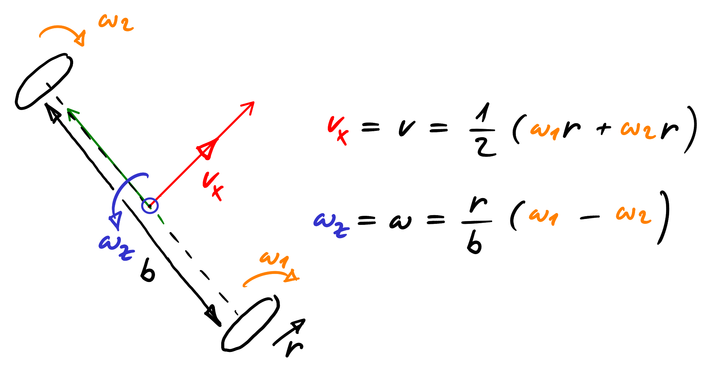

<!-- link list, last updated 16.02.2024 -->
[0]: https://en.wikipedia.org/wiki/Differential_wheeled_robot

# Differential Drive Robot Kinematics

The kinematics of a differential drive robot describe the relationship between the robot's wheel speed and the translational and rotational velocity of the robot with respect to the robot's body frame. The kinematic model accounts for physical parameters such as wheel radius, wheelbase (distance between the wheels), and the differential drive configuration. The goal of this document is to provide a brief overview of the kinematic model and a simple example of how to calculate the necessary wheel speed of a differential drive robot given the desired translational and rotational velocity of the robot.

## Links

[Wikipedia: Differential Wheeled Robot][0]

## Problem Overview

**Model parameters:**
- Wheel radius $r$
- Wheel base $b$

**Input values:**
- Forward velocity $v$
- Rotational velocity with respect to the robot's Z axis $\omega$

**Output values:**
- Right wheel velocity $\omega_1$
- Left wheel velocity $\omega_2$

**NOTE:**
- For the implementation in C++, we use Eigen. Eigen is a powerful C++ library for linear algebra.

## Deriving the Kinematic Model

<p align="center">
     </br>
    <i>Sketch Differential Drive Robot Kinematics</i>
</p>

The computation should start by defining the geometric relationships and using simple formulas to derive transformation matrices that map the wheel speeds to the robot’s motion—both its translation and rotation around the center.

### Linear velocity

The linear speed of the robot can be calculated as the average value of the speed of the right and left wheels

$$
v = \frac{v_1 + v_2}{2}
$$

The linear speed of a wheel is given by

$$
v_i = \omega_i \ r,\ i = 1, 2
$$

Therefore, we can write

$$
v = \frac{\omega_1 \ r + \omega_2 \ r}{2}
$$

and split this into the form

$$
v = \frac{r}{2} \ \omega_1 + \frac{r}{2} \ \omega_2
$$

### Rotational velocity with respect to the Robot's Z axis

Assuming that the two wheels are spinning positive in the forward direction of the robot, the rotational speed can be expressed by the following equation

$$
\omega = \frac{v_1 - v_2}{b}
$$

Expressing this in terms of the rotational speed of the wheels, we get

$$
\omega = \frac{\omega_1\ r - \omega_2\ r}{b}
$$

and split this into the form

$$
\omega = \frac{r}{b} \ \omega_1 - \frac{r}{b} \ \omega_2
$$

### Transformation matrix

From the above equations, the transformation matrix can be directly determined. The matrix maps the vector of the wheel speeds to translational and rotational velocity of the robot.

$$
\begin{bmatrix}
v \\\
\omega
\end{bmatrix} =
\begin{bmatrix}
\frac{r}{2} & \frac{r}{2} \\\
\frac{r}{b} & -\frac{r}{b}
\end{bmatrix}
\
\begin{bmatrix}
\omega_1 \\\
\omega_2
\end{bmatrix}
$$

$$
\mathbf{C}_{wheel2robot} =
\begin{bmatrix}
\frac{r}{2} & \frac{r}{2} \\\
\frac{r}{b} & -\frac{r}{b}
\end{bmatrix}
$$

However, our goal is the inverse transformation, that is, from linear and rotational velocity to wheel speeds. By inverting the transformation matrix, we get

$$
\begin{bmatrix}
\omega_1 \\\
\omega_2
\end{bmatrix} =
\begin{bmatrix}
\frac{1}{r} & \frac{b}{2\ r} \\\
\frac{1}{r} & -\frac{b}{2\ r}
\end{bmatrix}
\
\begin{bmatrix}
v \\\
\omega
\end{bmatrix}
$$

$$
\mathbf{C}_{robot2wheel} =
\begin{bmatrix}
\frac{1}{r} & \frac{b}{2\ r} \\\
\frac{1}{r} & -\frac{b}{2\ r}
\end{bmatrix}
$$

## Example Code

As mentioned previously, when writing code with the above transformations, Eigen is used to define vectors and matrices and perform linear algebra. First, we define the geometric values of the vehicle, such as wheel radius and wheelbase. In addition, we implement the corresponding matrix and define vectors that will be used to store the wheel speeds and robot velocities.

```cpp
#include "DCMotor.h"
#include <Eigen/Dense>

#define M_PIf 3.14159265358979323846f // pi
```

```cpp
// create object to enable power electronics for the dc motors
DigitalOut enable_motors(PB_ENABLE_DCMOTORS);

const float voltage_max = 12.0f; // maximum voltage of battery packs, adjust this to
                                 // 6.0f V if you only use one battery pack
const float gear_ratio = 100.00f;
const float kn = 140.0f / 12.0f;
// motor M1 and M2, do NOT enable motion planner when used with the LineFollower (disabled per default)
DCMotor motor_M1(PB_PWM_M1, PB_ENC_A_M1, PB_ENC_B_M1, gear_ratio, kn, voltage_max);
DCMotor motor_M2(PB_PWM_M2, PB_ENC_A_M2, PB_ENC_B_M2, gear_ratio, kn, voltage_max);

// differential drive robot kinematics
const float r_wheel = 0.0563f / 2.0f; // wheel radius in meters
const float b_wheel = 0.13f;          // wheelbase, distance from wheel to wheel in meters
// transforms wheel to robot velocities
Eigen::Matrix2f Cwheel2robot;
Cwheel2robot <<  r_wheel / 2.0f   ,  r_wheel / 2.0f   ,
                 r_wheel / b_wheel, -r_wheel / b_wheel;
Eigen::Vector2f robot_coord = {0.0f, 0.0f};  // contains v and w (robot translational and rotational velocity)
Eigen::Vector2f wheel_speed = {0.0f, 0.0f};  // contains w1 and w2 (wheel speed)
```

Make sure that you enabled the motors before setting the velocities:

```cpp
// enable hardwaredriver dc motors: 0 -> disabled, 1 -> enabled
enable_motors = 1;
```

To calculate the rotational speeds of the wheels, you must first define the desired values of the linear and rotational speed of the robot, e.g.,

```cpp
// set robot velocities
robot_coord(0) = 1.0f; // set desired translational velocity in m/s
robot_coord(1) = 0.5f; // set desired rotational velocity in rad/s
```

Then we apply the inverse transformation with the following command:

```cpp
// map robot velocities to wheel velocities in rad/sec
wheel_speed = Cwheel2robot.inverse() * robot_coord;
```

To access the individual wheel speeds, map them from radians per second to rotations per second and send them as velocity setpoints to the dc motors, we can simply use:

```cpp
// setpoints for the dc motors in rps
motor_M1.setVelocity(wheel_speed(0) / (2.0f * M_PIf)); // set a desired speed for speed controlled dc motors M1
motor_M2.setVelocity(wheel_speed(1) / (2.0f * M_PIf)); // set a desired speed for speed controlled dc motors M2
```

Make sure to test the code with different individual values for the robot velocities and check if the robot reacts as expected.

## Advanced Example

A slightly more advanced example is the calibration of the kinematic model. The goal is to determine both wheel radius and the wheelbase such that the robot moves as precisely as possible.

- [Example Differential Drive Robot Kinematics Calibration](../solutions/main_dd_kinematic_calib.cpp)
