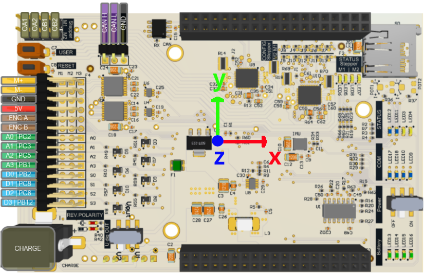
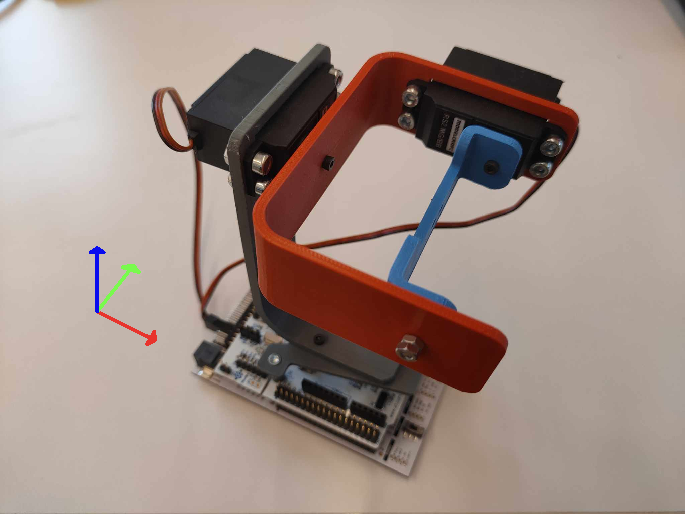

<!-- link list, last updated 15.01.2023 -->
[0]: https://www.sparkfun.com/products/retired/13284
[1]: https://compsci290-s2016.github.io/CoursePage/Materials/EulerAnglesViz/
[2]: https://www.youtube.com/watch?v=whSw42XddsU

# IMU

An IMU (Inertial Measurement Unit) sensor is a compact electronic device that measures and reports motion-related data. It typically consists of a 3D gyroscope, a 3D accelerometer, and sometimes a 3D magnetometer. Gyroscopes measure angular velocity, accelerometers measure linear acceleration, and magnetometers detect magnetic fields. IMU sensors are commonly used in robotics, drones, wearable devices, and motion-capture systems to track orientation, angular velocity, and linear acceleration. They provide essential data for navigation, stabilization, and motion analysis in various applications.

<p align="center">
     </br>
    <i>LSM9DS1 Breakout Board</i>
</p>

## Technical Specifications

|                     | LSM9DS1 IMU sensor                               |
| ------------------- | ------------------------------------------------ |
| Channels            | 3D gyroscope, 3D acceleration, 3D magnetic field |
| Data output         | 16 bit                                           |
| Interface           | SPI/I2C                                          |
| Supply voltage      | 1.9 V to 3.6V                                    |
| Linear acceleration | ±2/±4/±8/±16 g                                   |
| Gauss magnetic      | ±4/±8/±12/±16                                    |
| Dps angular rate    | ±245/±500/±2000                                  |

## Links

- [SparkFun 9DoF IMU Breakout - LSM9DS1][0] <br>

## Datasheets

- [LSM9DS1](../datasheets/lsm9ds1.pdf)

## Principle of Operation

An IMU with 9 degrees of freedom is a device that measures and provides information about a body's specific acceleration, rotation rate, and the magnetic field measured in the IMU frame. It does this by using a combination of accelerometers, gyroscopes, and magnetometers.
- **Accelerometer** - measures linear acceleration (change in velocity) along the three axes of 3D space. MEMS (Micro-Electro-Mechanical Systems) accelerometers typically use a small proof mass suspended between fixed electrodes. When the device accelerates, the proof mass shifts due to inertia, changing the distance between it and the fixed electrodes. This alters the capacitance, which is measured by electronic circuitry.
- **Gyroscope** - measures angular velocity (rate of rotation) around the three axes. MEMS gyroscopes use a vibrating structure (often a vibrating mass or tuning fork). When the device rotates, the Coriolis effect causes a secondary vibration perpendicular to the primary vibration. This Coriolis-induced displacement is sensed and converted into a rotational rate signal.
- **Magnetometer** - measures the strength and direction of the magnetic field in 3D space. MEMS magnetometers commonly use Hall-effect sensors or magnetoresistive elements, rather than vibrating masses. When exposed to a magnetic field, these components experience a change in voltage (Hall effect) or resistance (magnetoresistive), which is measured by electronic circuitry and translated into a digital signal.

### Sensor Fusion

To achieve sufficient data accuracy, sensor fusion uses specialized algorithms to integrate measurements from multiple sensors of varying types. By combining the strengths of different sensors, this process capitalizes on their respective favorable characteristics, culminating in achieving the most precise measurements possible.

A good example to understand the idea of sensor fusion is the estimation of the roll angle (rotation around the imu x-axis) using an accelerometer and a gyroscope.

The measurements from the gyroscope and the measurements from the accelerometer can be used individually to estimate the roll angle. However, such an estimation will not be accurate due to the disadvantages of each of these sensors.

The gyroscope has generally good signal quality (low noise), but usually has a bias or even drift (slowly varying bias).

$$
y_{gyro}(t) = \omega_x(t) + b_{gyro}(t), \ \phi(t) = \int_{0}^{t} \omega_x(\tau) d\tau
$$

Clearly, we cannot just integrate the gyroscope signal to get the angle; the bias will accumulate over time and lead to drift in the angle estimation.

The accelerometer, on the other hand, has no bias (if calibrated properly) but significant noise. Based on the accelerometer measurements the angle relative to gravity can be calculated.

$$
y_{acc}(t) = \phi(t) + \eta_{acc}(t) = \tan^{-1}\left(\frac{a_y(t)}{a_z(t)}\right) + \eta_{acc}(t)
$$

These two signals can be fused so that we combine the precise operation of the gyroscope in the short term and use the accelerometer for long-term correction. This fusion can be done with different techniques, with the simplest form being a complementary filter. This approach uses a low-pass filter for measurements from the accelerometer and a high-pass filter for the integral of measurements from the gyroscope.

$$
G_{lp}(s) = \frac{1}{T s + 1}
$$

$$
G_{hp}(s) = 1 - G_{lp}(s) = 1 - \frac{1}{T s + 1} = \frac{T s}{T s + 1}
$$

Combining the integrator for the gyroscope with the high-pass filter leads to the following equation

$$
\hat{\phi} = G_{lp}(s) \ y_{acc} + G_{hp}(s) \ \frac{1}{s} \ y_{gyro}
$$

after simplifications, we end up with the complementary filter

$$
\hat{\phi} = \frac{1}{T s + 1} \ y_{acc} + \frac{T}{T s + 1} \ y_{gyro}
$$

Remarkable here is that both filters are low-pass filters; the one that is applied to the gyroscope is just scaled with the time constant $T$.

<p align="center">
     </br>
    <i>Complementary Filter</i>
</p>

A link to a video, which explains the above in a very accessible way, can be found [here][2].

The ``IMU`` class uses a Mahony filter to estimate the orientation in 3D space by combining data from accelerometer and gyroscope sensors. The Mahony filter can also use magnetometer data to estimate heading information using the measurement of the Earth's magnetic field. This allows for absolute orientation estimation relative to magnetic north (which in general is not true north). The Mahony filter can be thought of as a generalization of the complementary filter to 3D space, where the gyroscope provides angular velocity data, the accelerometer provides tilt information, and the magnetometer provides heading information.

**IMPORTANT NOTE:**

- If no magnetometer is used, the Mahony filter will only estimate roll and pitch accurately, but yaw will drift over time. This is because the gyroscope only provides relative orientation changes, and without a reference (like the magnetometer), the yaw angle will accumulate errors.

### Magnetometer

In order to be able to estimate the heading, a magnetometer is needed. This sensor measures the strength and direction of Earth's magnetic field with respect to the IMU body frame.

However, integrating magnetometer data into sensor fusion algorithms presents challenges, primarily stemming from the need for accurate calibration. Magnetometers are highly sensitive instruments that can be influenced by various sources of magnetic interference, including nearby metallic objects and electrical equipment like motors. These external factors can distort the measured magnetic field, leading to inaccuracies in orientation estimation. In general, magnetometers are not useful in indoor environments.

So if no information about heading is needed, it is recommended not to use the magnetometer data in the IMU driver.

**NOTE:**

By default, the IMU is not using the magnetometer. To enable it, it is necessary to change

```cpp
#define IMU_THREAD_DO_USE_MAG_FOR_MAHONY_UPDATE true
```

to true in the ``IMU.h`` file:

- A MATLAB file used for magnetometer calibration can be found [here](../dev/dev_imu/99_fcn_bib/MgnCalibration.m).

## Practical Tips

The IMU is mounted on the PES board as shown in the following image. However, there are different versions of the PES board, so the alignment of the IMU may vary. Therefore, it is important to check the alignment of the IMU based on measurements. The simplest way to do this is to print the acceleration measurements to the console.

<p align="center">
     </br>
    <i>IMU coordinate system</i>
</p>

## IMU Driver

The ``IMU`` class is a tool used to process the measurements of the IMU and estimate the orientation of the board relative to gravity and to Earth's magnetic field.

The following data can be obtained directly from the driver:
- Gyroscope - values in three XYZ axes
- Accelerometer - values in three XYZ axes
- Magnetometer - values in three XYZ axes
- Board orientation expressed in quaternions obtained by means of sensor fusion using a Mahony filter
- Board orientation expressed in Tait-Bryan angles ZYX in the Roll Pitch Yaw convention, see the visualization [here][1]
- Board orientation expressed in Tait-Bryan angles ZXY in the Pitch Roll Yaw convention
- Tilt angle

To start working with the ``IMU``, it is necessary to create an object in the ***main.cpp*** file and assign the correct pins.

There is no need to connect anything as the IMU is an integral part of the PES board. Pins that are used to communicate with the IMU:

```cpp
// IMU
#define PB_IMU_SDA PC_9
#define PB_IMU_SCL PA_8
```

### Create IMU Object

Add the IMU driver ``IMU.h`` to the top of the ***main.cpp*** file:

```cpp
#include "IMU.h"
```

To be able to start to use the ``IMU`` driver, the initial step is to create the IMU object and specify the pins to which the hardware is connected in the ``main()`` scope.

As mentioned, the IMU uses two pins to communicate via I2C. The next step is to create an object of the class alongside a data container that will be used to collect the data read from the IMU. The data container is of type ``ImuData`` and is defined in the ``IMU.h`` file.

```cpp
// imu
ImuData imu_data;
IMU imu(PB_IMU_SDA, PB_IMU_SCL);
```

### Read Measurements

Once the objects have been declared, it is possible to read data from the sensor. As mentioned, this data is processed inside the class with the appropriate filters, and in addition to reading the sensor values themselves, the orientation of the board in space is estimated and expressed in quaternions and angles.

```cpp
// read imu data
imu_data = imu.getImuData();
```

```cpp
// acceleration in meters per second squared in three axes
float acc_x = imu_data.acc(0);
float acc_y = imu_data.acc(1);
float acc_z = imu_data.acc(2);
```

```cpp
// gyroscope in radians per second in three axes
float gyro_x = imu_data.gyro(0);
float gyro_y = imu_data.gyro(1);
float gyro_z = imu_data.gyro(2);
```

```cpp
// right-hand rule unit quaternion
float quat_w = imu_data.quat.w();
float quat_x = imu_data.quat.x();
float quat_y = imu_data.quat.y();
float quat_z = imu_data.quat.z();
```

```cpp
// roll, pitch, yaw according to Tait-Bryan angles ZYX
// where R = Rz(yaw) * Ry(pitch) * Rx(roll) for ZYX sequence
// singularity at pitch = +/-pi/2 radians (+/- 90 deg)
float roll = imu_data.rpy(0);
float pitch = imu_data.rpy(1);
float yaw = imu_data.rpy(2);
```

```cpp
// pitch, roll, yaw according to Tait-Bryan angles ZXY
// where R = Rz(yaw) * Rx(roll) * Ry(pitch)
// singularity at roll = +/-pi/2
float pitch = imu_data.pry(0);
float roll = imu_data.pry(1);
float yaw = imu_data.pry(2);
```

## 2-Axis Gimbal Example

In order to demonstrate how the IMU can be used, a 2D gimbal has been prepared requiring printing a few parts and assembling the appropriate servos.

<p align="center">
     </br>
    <i>2-Axis Gimbal</i>
</p>

Prepared parts in `.stl` format for printing can be found [here](../cad/gimbal); additionally, step files are also present in case you wish to modify them. The parts are prepared for two Modelcraft RS2 MG/BB servos.

**NOTE:**
- Remember to calibrate the servos before using them for proper operation of the gimbal.
- The servo for the roll movement ``PB_D0`` is attached to the first joint (grey)
- The servo for the pitch movement ``PB_D1`` is attached to the second joint (red)

The gimbal allows stabilization in two axes. Assuming that the horizontal flat surface is defined by the X and Y axes, in the event of a deflection of the PES board in both of these axes, the servos will compensate for these deflections and cause the mount to be in a perpendicular orientation with respect to the plane.

### Software

The ***main.cpp*** file has the standard form known from the base file. Add the IMU ``IMU.h`` and servo ``Servo.h`` driver to the top of the ***main.cpp*** file:

```cpp
#include "IMU.h"
#include "Servo.h"
```

as well as the constant $\pi$

```cpp
#define M_PIf 3.14159265358979323846f // pi
```

In order to properly program the gimbal, it is necessary to define the ``Servo`` object responsible for roll and the servo responsible for pitch, as well as the IMU along with the object for collecting the necessary data.

```cpp
// servo
Servo servo_roll(PB_D0);
Servo servo_pitch(PB_D1);

// imu
ImuData imu_data;
IMU imu(PB_IMU_SDA, PB_IMU_SCL);
Eigen::Vector2f rp(0.0f, 0.0f);
```

The servos must be calibrated before use and the appropriate values must be entered into the calibration functions. In addition, angle limits of the servos and the values of the coefficients of the linear functions that allow the signal to be mapped as an angle to the PWM pulse width are also defined.

```cpp
// minimal pulse width and maximal pulse width obtained from the servo calibration process
// modelcraft RS2 MG/BB
float servo_ang_min = 0.035f;
float servo_ang_max = 0.130f;

// servo.setPulseWidth: before calibration (0,1) -> (min pwm, max pwm)
// servo.setPulseWidth: after calibration (0,1) -> (servo_D0_ang_min, servo_D0_ang_max)
servo_roll.calibratePulseMinMax(servo_ang_min, servo_ang_max);
servo_pitch.calibratePulseMinMax(servo_ang_min, servo_ang_max);

// angle limits of the servos
const float angle_range_min = -M_PIf / 2.0f;
const float angle_range_max =  M_PIf / 2.0f;

// angle to pulse width coefficients
const float normalised_angle_gain = 1.0f / M_PIf;
const float normalised_angle_offset = 0.5f;
```

Next, the necessary variables are defined along with the zero orientation of servos:

```cpp
// pulse width
static float roll_servo_width = 0.5f;
static float pitch_servo_width = 0.5f;

servo_roll.setPulseWidth(roll_servo_width);
servo_pitch.setPulseWidth(pitch_servo_width);
```

The next step is to place the command that reads data from the IMU.

```cpp
// read imu data
imu_data = imu.getImuData();

// pitch, roll, yaw according to Tait-Bryan angles ZXY
// where R = Rz(yaw) * Rx(roll) * Ry(pitch)
// singularity at roll = +/-pi/2
rp(0) = imu_data.pry(1); // roll angle
rp(1) = imu_data.pry(0); // pitch angle
```

To activate the servo, use the following command. Place this command to enable the servo after initiating the program execution with the **USER** button:

```cpp
// enable the servos
if (!servo_roll.isEnabled())
    servo_roll.enable();
if (!servo_pitch.isEnabled())
    servo_pitch.enable();
```

Then map the angles to the range 0 to 1.

```cpp
// map to servo commands
roll_servo_width  = -normalised_angle_gain * rp(0) + normalised_angle_offset;
pitch_servo_width =  normalised_angle_gain * rp(1) + normalised_angle_offset;
if (angle_range_min <= rp(0) && rp(0) <= angle_range_max)
    servo_roll.setPulseWidth(roll_servo_width);
if (angle_range_min <= rp(1) && rp(1) <= angle_range_max)
    servo_pitch.setPulseWidth(pitch_servo_width);
```

Add the following command to the ``else()`` statement; the purpose is to set the servo initial position. This is triggered by pressing the **USER** button while the main task is running (the second time you press the button).

```cpp
// reset variables and objects
roll_servo_width = 0.5f;
pitch_servo_width = 0.5f;
servo_roll.setPulseWidth(roll_servo_width);
servo_pitch.setPulseWidth(pitch_servo_width);
```

For debugging purposes, it is useful to print the normalized angles to the serial terminal. This can be done by adding the following code snippet at the end of the main loop.

```cpp
// print to the serial terminal
printf("%6.2f, %6.2f \n", roll_servo_width, pitch_servo_width);
```

## Example

- [Example Gimbal](../solutions/main_gimbal.cpp)
