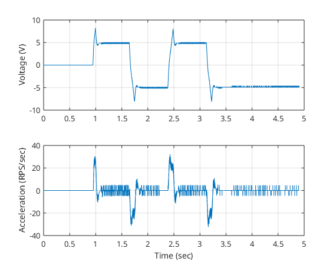
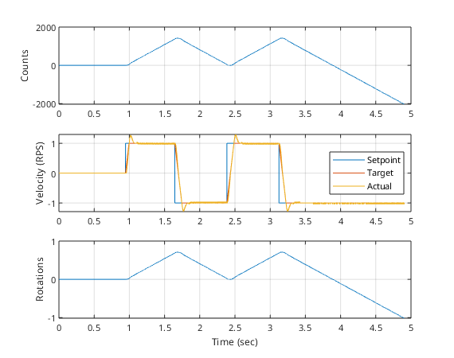

# Advanced Topics

## Complementing your own DC Motor Driver

Connect a DC Motor to the PES Board... TODO: Write commissioning stuff

We start with a partially set up DC Motor class ``MyDCMotor``. We will add the missing parts to make it functional. The goal is to use your own ``MyDCMotor`` class within the project.

- [MYDCMotor.h](../solutions/MyDCMotor/MyDCMotor.h)
- [MYDCMotor.cpp](../solutions/MyDCMotor/MyDCMotor.cpp)

It inherits from the class template ``RealTimeThread``. So everything related to the real-time thread is already set up.

The main task is to parametrisize and implement a PI controller for the speed of the motor. To make an informed descision for the controller tuning we will start with a Frequency Response measurement. This measured Frequency Response will be used to model the input output dynamics of the motor with the input voltage in V and the output speed in RPS.

For the model we use the Ansatz

$$
G(s) = \frac{K}{(T_1 s + 1)^n} e^{-s Tt}
$$

whereas $K$ is the gain, $T_1$ is the time constant, $n$ is the order of the system and $T_t$ is the dead time. The order of the system is determined by the number of equal poles in the transfer function $p = -\frac{1}{T_1}$ and the cut off frequency $f_{cut} = \frac{1}{2 \pi T_1}$.

To tune the PI controll we will


<!-- % Chien-Hrones-Reswick PI tuning
% Reference: Chien, Hrones, Reswick (1952), Åström & Hägglund, Seborg et al.
% Assumed model: First-order plus dead time (FOPDT):
%
%   G(s) = K / (T1*s + 1) * e^(-Tt*s)
%
% Approximation of your actual plant:
% - The n-lag system is approximated to an equivalent FOPDT using:
% - These formulas are empirically derived from Åström & Hägglund, based on matching step response behavior.
%   Purpose: This allows the use of classical CHR PI tuning formulas based on FOPDT.
%
%   T1_approx = T1 * (n + 1)/2
%   Tt_approx = T1 * (n - 1)/2 + Tt
%
% Tuning for ~20% overshoot (faster tuning)
%
%   Kp = 0.6 * T1 / (Tt * K)
%   Ti = T1
%
% - Here the plant approximation (FOPDT) is used. -->


### Getting Started

Include the header.

```cpp
#include "MyDCMotor.h"
```

Create the necessary digital output to enable the power electronics and create an instance of the ``MyDCMotor`` class.

```cpp
// create object to enable power electronics for the dc motors
DigitalOut enable_motors(PB_ENABLE_DCMOTORS);

// https://www.pololu.com/product/3490/specs
const float gear_ratio = 100.00f;
const float kn = 140.0f / 12.0f;
const float voltage_for_one_RPS = 60.0f / kn;
MyDCMotor motor_M1(PB_PWM_M1, PB_ENC_A_M1, PB_ENC_B_M1, gear_ratio, kn);
```

In the ***main.cpp*** file in the ``if()`` function add the following code.

```cpp
// enable the motors if they are not enabled yet
if (!enable_motors) {
    enable_motors = 1;
}

// write the desired voltage to the motor
motor_M1.setVoltage(voltage_for_one_RPS);
```

To print the counts, velocity, rotations, and voltage to the serial terminal, add the following code after setting the voltage.

```cpp
// print to the serial terminal
printf("Counts: %6ld Velocity RPS: %6.2f Rotations: %6.2f Voltage: %6.2f\n", motor_M1.getCounts(),
                                                                             motor_M1.getVelocity(),
                                                                             motor_M1.getRotation(),
                                                                             motor_M1.getVoltage());
```

After compiling and uploading the code to the PES Board, open the serial terminal at 115200 baud rate. You should see the counts, velocity in RPS, rotations, and voltage printed when you press the blue button on the PES Board. The motor should turn at approximately 1 RPS.

### Measuring the Frequency Response and Tuning the PI Controller

In the ''MyDCMotor.cpp'' file adjust the ``executeTask()`` function according to the next code snippet.

```cpp
void MyDCMotor::executeTask()
{
    // read encoder signals
    m_encoder_signals = m_Encoder.update();

    // Be careful: the static objects and variables are shared across all instances of this class.
    // They are intended for debugging purposes only, assuming a single instance exists.
    // Do not use this in production code!

    // static serial stream to send data over uart
    static SerialStream serialStream(PB_10 /*tx*/, PC_5 /*rx*/);

    // static timer to measure time elapsed since last call
    static Timer timer;
    static microseconds time_previous_us{0};
    timer.start();
    const microseconds time_us = timer.elapsed_time();
    const float dtime_us = duration_cast<microseconds>(time_us - time_previous_us).count();
    time_previous_us = time_us;

    // static chirp signal
    static const float f0 = 0.1f;                  // start frequency in Hz
    static const float f1 = 0.99f / (2.0f * m_Ts); // end frequency in Hz, has to be less than Nyquist frequency
    static const float t1 = 20.0f;                 // duration in seconds
    static const float amplitude = 3.0f;
    static Chirp chirp(f0, f1, t1, m_Ts);

    // update chirp signal and send signal over serial stream
    float chirp_exc = 0.0f;
    if (serialStream.startByteReceived() && chirp.update()) {
        // update chirp excitation
        chirp_exc = amplitude * chirp.getExc();

        // send data over serial stream
        serialStream.write( dtime_us );                        //  0 delta time in us
        serialStream.write( (float)m_encoder_signals.counts ); //  1 encoder counts
        serialStream.write( m_encoder_signals.velocity );      //  2 encoder velocity in rotations per second
        serialStream.write( m_encoder_signals.rotations );     //  3 encoder rotations in turns
        serialStream.write( m_voltage + chirp_exc );           //  4 voltage in V
        serialStream.write( chirp.getSinarg() );               //  5 chirp sinarg in radians
        serialStream.send();
    }

    // update motor with current target voltage
    m_Motor.setVoltage(m_voltage + chirp_exc);
}
```

Here we create a ``Timer`` object to measure relative time differences in microseconds. We also create a ``Chirp`` object to generate a chirp signal that sweeps from 0.1 Hz to 0.99 times the Nyquist frequency over 20 seconds. The chirp signal is added to the target voltage of the motor.

In the ***main.cpp*** file in the ``if()`` function we change the code to the following:

```cpp
// write the desired voltage to the motor
motor_M1.setVoltage(6.0f);
```

To evaluate the data further we either use MATLAB or Python. The data is sent over the serial stream to MATLAB or Python. The SerialStream.m and SerialStream.py classes also trigger the start of the chirp signal when the start byte is received.

- [MATLAB Modelling and Control Design using SerialStream](../solutions/matlab/serial_stream_pi_controller.m) (interactive)
- [Python Modelling and Control Design using SerialStream](../solutions/python/serial_stream_pi_controller.py)
- [Python Modelling and Control Design using SerialStream](../solutions/python/serial_stream_pi_controller.ipynb) (interactive)

Use one of the above scripts to evaluate the data. Study the script and adapt it to your needs. The goal here is to model the plant, approximate it through a first-order plus dead time (FOPDT) model and tune the PI controller using the Chien-Hrones-Reswick method for a 20% overshoot using the FOPDT model.

### Implementing the PI Controller

The time continous PI controller is given by

$$
C(s) = K_p + K_i\frac{1}{s}
$$

To be able to implement the PI controller in the ``MyDCMotor`` class we need to discretize the controller. For the integrator we use the euler backward method, which is given by

$$
C(z) = K_p + K_i \frac{T_s}{1 - z^{-1}}
$$

The code snippet below shows how to implement the PI controller in the ``MyDCMotor`` class.

```cpp
void MyDCMotor::executeTask()
{
    // read encoder signals
    m_encoder_signals = m_Encoder.update();

    // Be careful: the static objects and variables are shared across all instances of this class.
    // They are intended for debugging purposes only, assuming a single instance exists.
    // Do not use this in production code!

    // static serial stream to send data over uart
    static SerialStream serialStream(PB_10 /*tx*/, PC_5 /*rx*/);

    // static timer to measure time elapsed since last call
    static Timer timer;
    static microseconds time_previous_us{0};
    timer.start();
    const microseconds time_us = timer.elapsed_time();
    const float dtime_us = duration_cast<microseconds>(time_us - time_previous_us).count();
    time_previous_us = time_us;

    // set the target velocity to the setpoint
    m_velocity_target = m_velocity_setpoint;

    // apply the velocity PI controller
    const float velocity_error = m_velocity_target - m_encoder_signals.velocity;
    // calculate P controller term
    const float voltage_p_term = m_kp * velocity_error;
    // calculate I controller term
    m_voltage_i_term = saturate(m_voltage_i_term + m_ki * velocity_error * m_Ts, m_voltage_i_term_max);
    // calculate total voltage from PI controller and constrain the voltage to the maximum voltage
    float voltage = saturate(voltage_p_term + m_voltage_i_term, m_voltage_max);

    // update votage target
    m_voltage = voltage;

    if (serialStream.startByteReceived()) {
        // send data over serial stream
        serialStream.write( dtime_us );                        //  0 delta time in us
        serialStream.write( (float)m_encoder_signals.counts ); //  1 encoder counts
        serialStream.write( m_encoder_signals.velocity );      //  2 encoder velocity in rotations per second
        serialStream.write( m_encoder_signals.rotations );     //  3 encoder rotations in turns
        serialStream.write( m_voltage);                        //  4 voltage in V
        serialStream.write( m_velocity_setpoint );             //  5 velocity setpoint in rotations per second
        serialStream.write( m_velocity_target );               //  6 velocity target in rotations per second
        serialStream.send();
    }

    // update motor with current target voltage
    m_Motor.setVoltage(m_voltage);
}
```

In the ***main.cpp*** file after the ``MyDCMotor`` object creation, we set the PI controller parameters.

```cpp cpp
motor_M1.setVelocityCntrl(.../*Kp*/, .../*Ki*/);
```

And in the ``if()`` set the desired velocity of the motor. For example, to set the desired velocity to 1 RPS, you can use:

**Important Note: After implementing the PI controller you have to remove the ``setVoltage`` completely at least in the ***main.cpp*** file. The voltage is now calculated from the controller internally.**

```cpp
// write desired velocity to the motor
motor_M1.setVelocity(1.0f);
```

To evaluate the performance of the PI controller we can use the following scripts:

- [MATLAB Data Evaluation using SerialStream (*.m)](../solutions/matlab/serial_stream_eval.m) (interactive)
- [Python Data Evaluation using SerialStream (*.py)](../solutions/python/serial_stream_eval.py)
- [Python Data Evaluation using SerialStream (*.ipynb)](../solutions/python/serial_stream_eval.ipynb) (interactive)

You maybe see that that the actual velocity is statically offset from the setpoint. If so, this is due to the I-part saturation. You can adjust the saturation limit in the ``MyDCMotor`` class by adding

```cpp
motor_M1.setVelocityCntrlIntegratorLimitsPercent(100.0f); // defalut is at 30% of max voltage
```

after the ``MyDCMotor`` object creation.

The 30% default are a safety limit to prevent the I-part from accumulating too much. If you set it to 100% you can use the full range of the voltage, but you have to be careful no to destroy the motor when used on a robot.

### Limiting the Acceleration

It can be useful to limit the acceleration of the motor to prevent sudden changes in speed. This can be done by adding a simple acceleration limiter in the ``MyDCMotor`` class.

Remove this lines

```cpp
// set the target velocity to the setpoint
m_velocity_target = m_velocity_setpoint;
```

and add the following code snippet to the ``executeTask()`` function.

```cpp
// acceleration limiting: ramp m_velocity_target towards m_velocity_setpoint
const float velocity_target_error = m_velocity_setpoint - m_velocity_target;
const float max_velocity_change = m_acceleration_max * m_Ts;
if (fabsf(velocity_target_error) <= max_velocity_change) {
    // can reach setpoint in this time step
    m_velocity_target = m_velocity_setpoint;
} else {
    // need to limit acceleration
    if (velocity_target_error > 0.0f) {
        m_velocity_target += max_velocity_change;
    } else {
        m_velocity_target -= max_velocity_change;
    }
}
```

In here the velocity target is ramped towards the setpoint with a maximum change of `m_acceleration_max * m_Ts` per time step. This limits the acceleration of the motor.

To set the maximum acceleration, you can use the following code snippet in the ***main.cpp*** file after the ``MyDCMotor`` object creation:

```cpp
motor_M1.setMaxAcceleration(20.0f); // keep in mind that this introduced additional delay
```

You should measure now the set acceleration approximately. Be aware that this is not a hard limit, but a soft limit. The motor will still accelerate faster depending on the PI controller parameters.

### Adding Feed-Forward Control

To further reduce the delay between the target velocity and the actual velocity, we can add a feed-forward control term to the PI controller. This is done by adding a feed-forward term that is proportional to the target velocity.

Instead of

```cpp
// calculate total voltage from PI controller and constrain the voltage to the maximum voltage
float voltage = saturate(voltage_p_term + m_voltage_i_term, m_voltage_max);
```

we use the following code to add the feed-forward term:

```cpp
// add feedforward term and calculate total voltage from PI controller
// and constrain the voltage to the maximum voltage
const float voltage_f_term = (60.0f / m_kn) * m_velocity_target;
float voltage = saturate(voltage_p_term + m_voltage_i_term + voltage_f_term, m_voltage_max);
```

While accelerating constantly, the feed-forward term will remove the steady state error. Tradeoff is that the control system tends to more overshoot now.

<!-- <p align="center">
     </br>
    <i>Voltage and Acceleration when toggling between 1 and -1 RPS setpoint</i>
</p>

<p align="center">
     </br>
    <i>Counts, Velocity and Position when toggling between 1 and -1 RPS setpoint</i>
</p> -->

<div align="center">
  <table>
    <tr>
      <td align="center">
        
        <br/><i>Voltage and Acceleration</i>
      </td>
      <td align="center">
        
        <br/><i>Corresponding Counts, Velocity and Position</i>
      </td>
    </tr>
  </table>
</div>

### Removing everything not needed for Production

Make sure to remove everything that is not needed for the actual usage of the motor driver. In the end function ``executeTask()`` should look like this:

```cpp
void MyDCMotor::executeTask()
{
    // read encoder signals
    m_encoder_signals = m_Encoder.update();

    // acceleration limiting: ramp m_velocity_target towards m_velocity_setpoint
    const float velocity_target_error = m_velocity_setpoint - m_velocity_target;
    const float max_velocity_change = m_acceleration_max * m_Ts;
    if (fabsf(velocity_target_error) <= max_velocity_change) {
        // can reach setpoint in this time step
        m_velocity_target = m_velocity_setpoint;
    } else {
        // need to limit acceleration
        if (velocity_target_error > 0.0f) {
            m_velocity_target += max_velocity_change;
        } else {
            m_velocity_target -= max_velocity_change;
        }
    }

    // apply the velocity PI controller
    const float velocity_error = m_velocity_target - m_encoder_signals.velocity;
    // calculate P controller term
    const float voltage_p_term = m_kp * velocity_error;
    // calculate I controller term
    m_voltage_i_term = saturate(m_voltage_i_term + m_ki * velocity_error * m_Ts, m_voltage_i_term_max);

    // add feedforward term and calculate total voltage from PI controller
    // and constrain the voltage to the maximum voltage
    const float voltage_f_term = (60.0f / m_kn) * m_velocity_target;
    float voltage = saturate(voltage_p_term + m_voltage_i_term + voltage_f_term, m_voltage_max);

    // update votage target
    m_voltage = voltage;

    // update motor with current target voltage
    m_Motor.setVoltage(m_voltage);
}
```
