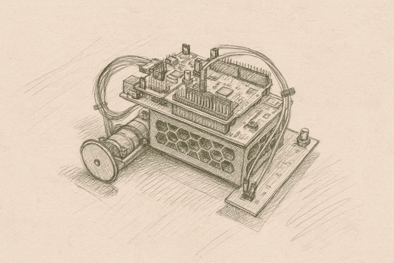

<!-- link list -->
[0]: https://os.mbed.com/platforms/ST-Nucleo-F446RE/

# Workshop 4

In the fourth workshop, we will explore differential drive robot kinematics and line following algorithms. Participants will learn how to transform desired robot velocities into individual wheel speeds and implement autonomous line following using an 8-sensor IR array.

## Hardware

>Part 1 and Part 2::
> - Fully functional differential drive robot

      
    <i>Differential Drive Robot</i>

### Assignment

- You have successfully completed the previous workshops.

## Part 1

In the first part, you will learn about differential drive robot kinematics and implement the mathematical transformations in C++. The mathematical foundation and implementation details are described in the [Tutorial Differential Drive Robot Kinematics](dd_kinematics.md) document.

### Tasks Summary

1. Implement the kinematic transformation matrix using Eigen
2. Test the robot's response to different velocity commands
3. Optional: Calibrate wheel radius and wheelbase parameters

## Part 2

In the second part, you will implement a line following system using the SparkFun Line Follower Array.

The line follower array uses eight IR sensors to detect black lines. The sensor data is processed to calculate the line's angle relative to the robot, which is used to generate steering commands.

### Tasks Summary

1. Connect the line follower array using I2C communication
3. Design a control law combining forward motion with line tracking
4. Test and tune control parameters
5. Optional: Use the ``LineFollower`` driver class

Detailed instructions and examples are provided in the [Tutorial Line Follower](line_follower.md) document.

## Summary

In this workshop, you learned differential drive robot kinematics and line following algorithms. You implemented mathematical transformations to control robot motion and used sensor feedback to create autonomous navigation behavior.

## Solutions

- [Workshop 4 Part 1 Solution: Example Differential Drive Robot Kinematics Calibration](../solutions/main_dd_kinematic_calib.cpp)
- [Workshop 4 Part 2 Solution: Example Line Follower Base](../solutions/main_line_follower_base.cpp)
- [Workshop 4 Part 2 Solution: Example Line Follower](../solutions/main_line_follower.cpp)
